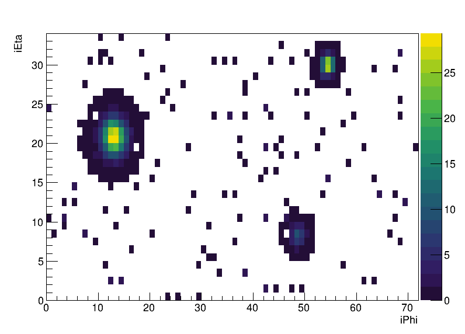
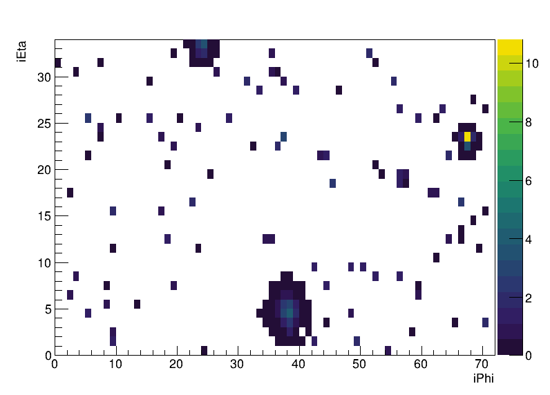

# TAC-HEP FPGA Project

## Setup

First I wrote a script to generate dummy calorimeter grids `generateCalorimeterGrid.cpp`. 
This creates 3 jets per event as Gaussian deposits at randomized locations, wrapping around `iPhi` cyclically.
In addition, Gaussian-distributed random noise is deposited throughout the grid.
Grid inputs must be a minimum of `1e-2` or else the cell is set to 0.
Here are one example of a dummy input, plotted using the ROOT macro `plotCalorimeterGrid.C`:




In order to remove the dependency of the HLS project on external input files, this grid generation method was replicated in the test bench `makeClusters_test.cpp`.
The clustering algorithm uses a sliding window to locate local maxima, then sums energy in sequentially larger grids to form 3x3, 5x5, and 7x7 clusters.
The minimum energy of a cluster seed is defined in the header file `makeClusters.h` as `clusterThreshold` and is set to 3. 
The cluster size increases from 3x3 to 5x5 or from 5x5 to 7x7 if the ratio of the smaller cluster's energy to the larger cluster's energy is less than `clusterStopThreshold`, which is set to 0.95.
Here is an example of the clustering in action:



The output for this example is:

```
Local Maximum found at (iEta=4, iPhi=38) with energy=4.00977
Local Maximum found at (iEta=23, iPhi=67) with energy=10.8193
Local Maximum found at (iEta=33, iPhi=24) with energy=3.34277
3x3 Clusters:
    Cluster 0: iEta=4, iPhi=38, Energy=20.3281
    Cluster 1: iEta=33, iPhi=24, Energy=9.8457
5x5 Clusters:
7x7 Clusters:
    Cluster 0: iEta=23, iPhi=3, Energy=20.0459
```

Without any pragmas, the latency is 61304 cycles and the resource estimation is as follows:

```
+---------------------+---------+------+---------+---------+-----+
|         Name        | BRAM_18K|  DSP |    FF   |   LUT   | URAM|
+---------------------+---------+------+---------+---------+-----+
|DSP                  |        -|     -|        -|        -|    -|
|Expression           |        -|     -|        0|        2|    -|
|FIFO                 |        -|     -|        -|        -|    -|
|Instance             |        -|     -|     6791|     9366|    -|
|Memory               |        -|     -|        -|        -|    -|
|Multiplexer          |        -|     -|        -|      199|    -|
|Register             |        -|     -|        9|        -|    -|
+---------------------+---------+------+---------+---------+-----+
|Total                |        0|     0|     6800|     9567|    0|
+---------------------+---------+------+---------+---------+-----+
|Available SLR        |     1440|  2280|   788160|   394080|  320|
+---------------------+---------+------+---------+---------+-----+
|Utilization SLR (%)  |        0|     0|       ~0|        2|    0|
+---------------------+---------+------+---------+---------+-----+
|Available            |     4320|  6840|  2364480|  1182240|  960|
+---------------------+---------+------+---------+---------+-----+
|Utilization (%)      |        0|     0|       ~0|       ~0|    0|
+---------------------+---------+------+---------+---------+-----+
```

So it is clear that the resource utilization is low while the latency is high, so we can afford to parallelize a bit.

I used the `HLS INTERFACE` pragma to utilize BRAM for the arrays and partitioned the `iPhi` dimension of the calorimeter grid (cyclic with factor of 8). 
I fully unrolled the loops that initialized all return values of the cluster arrays to 0. 
I unrolled the `iPhi` loop (the inner loop) of the clustering with a factor of 4.  
This brought the latency down to 31325 cycles (0.783 ms), around half of the original latency. 
This is still much higher than 25ns though.
The resource utilization increased as such:

```
+---------------------+---------+------+---------+---------+-----+
|         Name        | BRAM_18K|  DSP |    FF   |   LUT   | URAM|
+---------------------+---------+------+---------+---------+-----+
|DSP                  |        -|     -|        -|        -|    -|
|Expression           |        -|     -|        -|        -|    -|
|FIFO                 |        -|     -|        -|        -|    -|
|Instance             |        0|     -|    21216|    38895|    0|
|Memory               |        -|     -|        -|        -|    -|
|Multiplexer          |        -|     -|        -|      358|    -|
|Register             |        -|     -|        6|        -|    -|
+---------------------+---------+------+---------+---------+-----+
|Total                |        0|     0|    21222|    39253|    0|
+---------------------+---------+------+---------+---------+-----+
|Available SLR        |     1440|  2280|   788160|   394080|  320|
+---------------------+---------+------+---------+---------+-----+
|Utilization SLR (%)  |        0|     0|        2|        9|    0|
+---------------------+---------+------+---------+---------+-----+
|Available            |     4320|  6840|  2364480|  1182240|  960|
+---------------------+---------+------+---------+---------+-----+
|Utilization (%)      |        0|     0|       ~0|        3|    0|
+---------------------+---------+------+---------+---------+-----+
```

So the resource utilization went up quite a bit but it is still not bad.
