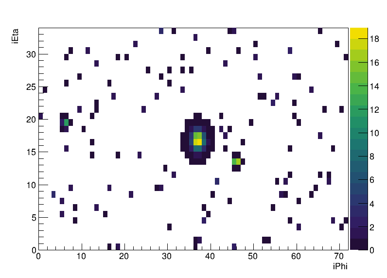

# TAC-HEP FPGA Project

## Setup

First I wrote a script to generate dummy calorimeter grids `generateCalorimeterGrid.cpp`. 
This creates 3 jets per event as Gaussian deposits at randomized locations, wrapping around `iPhi` cyclically.
In addition, Gaussian-distributed random noise is deposited throughout the grid.
Grid inputs must be a minimum of `1e-2` or else the cell is set to 0.
Here are some examples of the dummy events, plotted using the ROOT macro `plotCalorimeterGrid.C`:

